# 🎯 NoghteKur — Educational Management Platform
### Live Demo:  [https://noghtekur.ir](https://noghtekur.ir)
An all-in-one platform for **institutes, consultants, and students** — powered by AI-driven exam generation, assignment tracking, real-time messaging, and a reward-based scoring system.

## 📸 Platform Preview
### Sub-accounts/ Profiles

  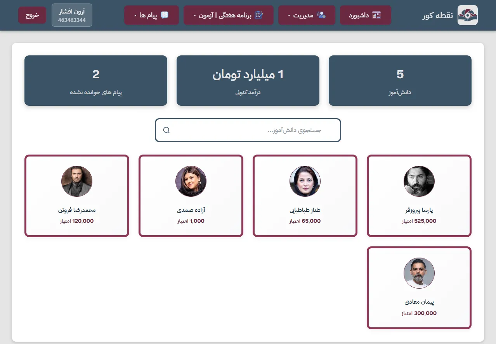
  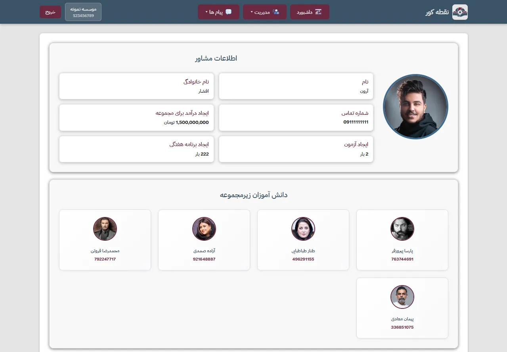
  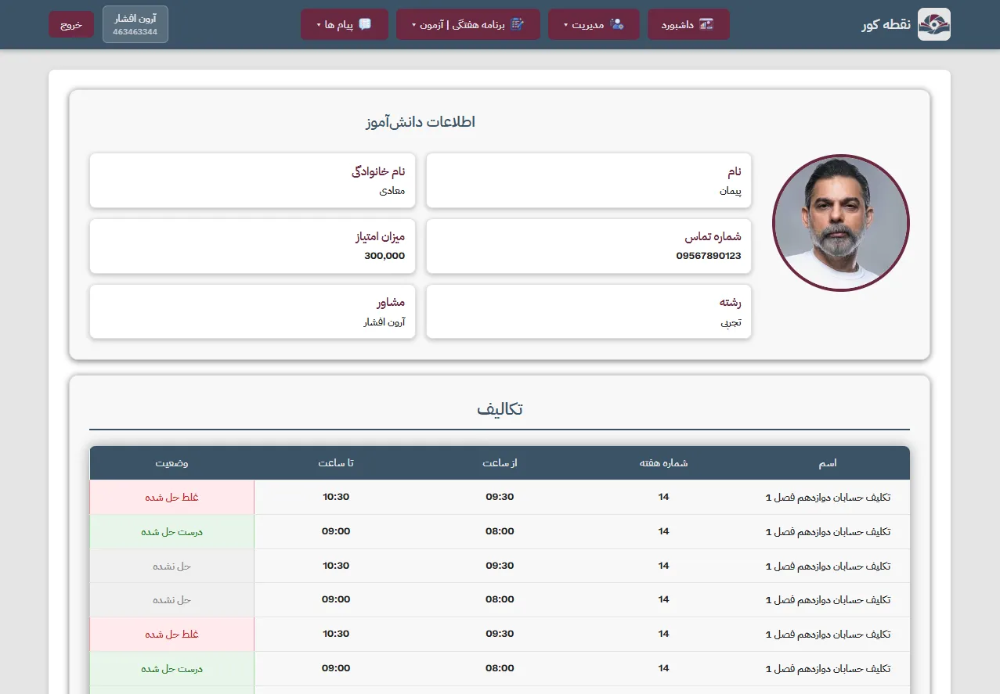

### Create Exam/ Last Exams/ Each Exam Details

  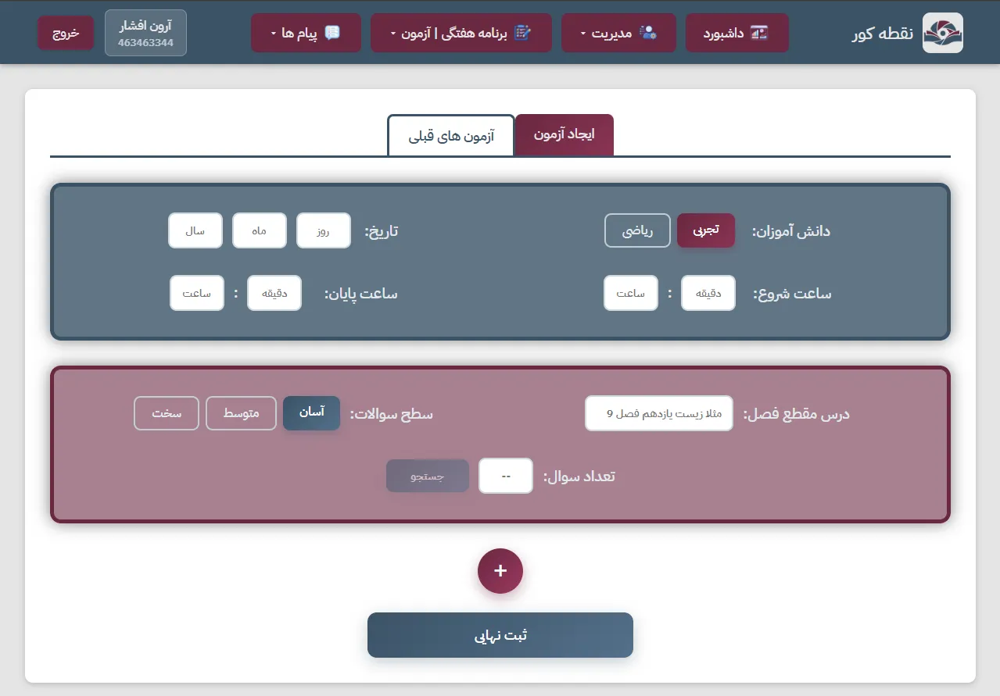
  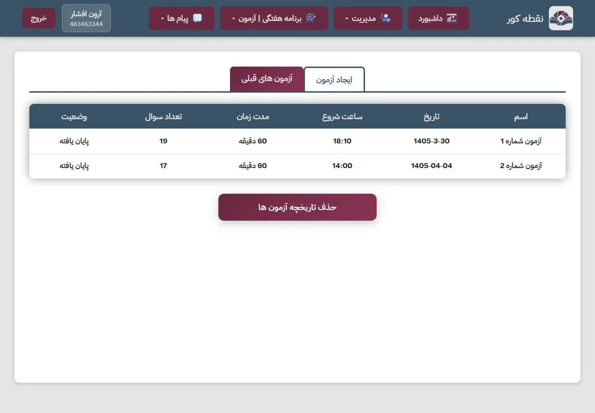
  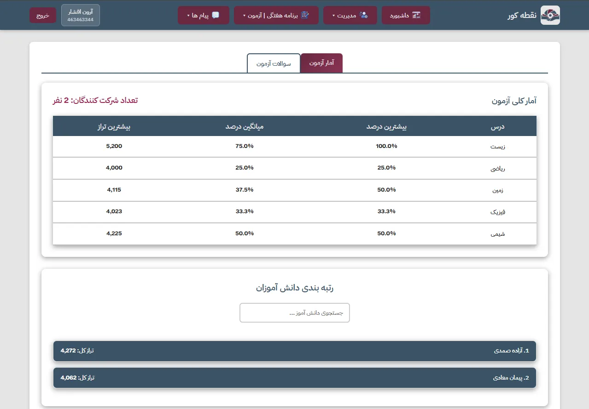
  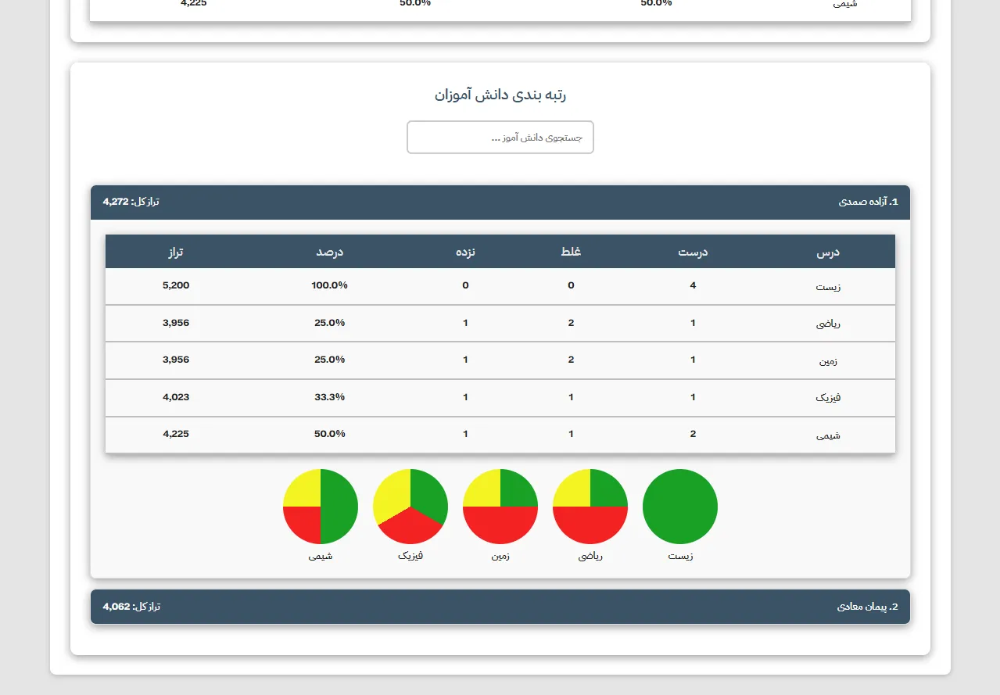

### Create Message/ Message List

  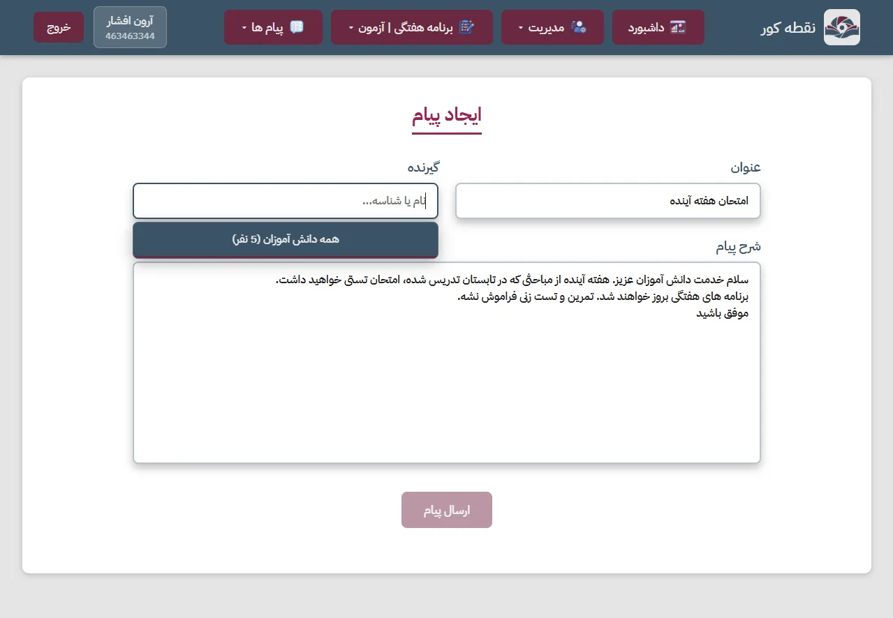
  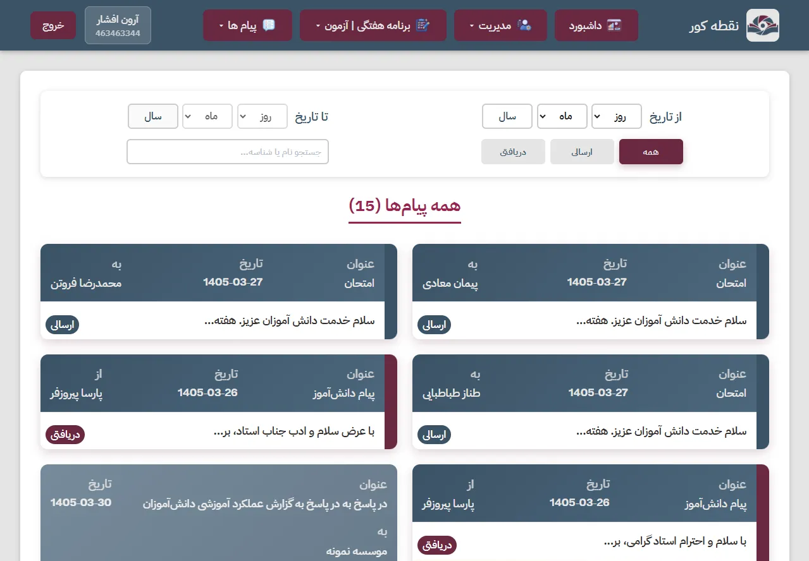

### Financial Charts

  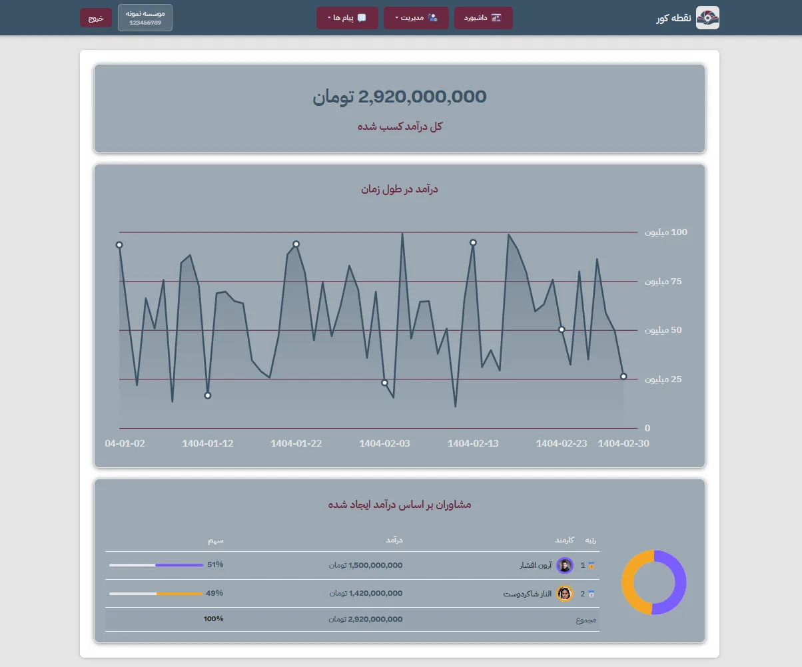

### Create Weekly Study Plan

  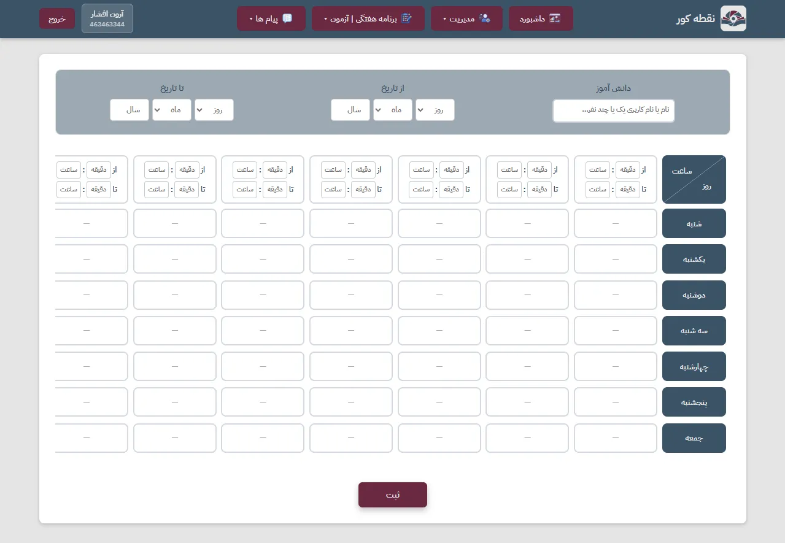

### Manage Accounts

  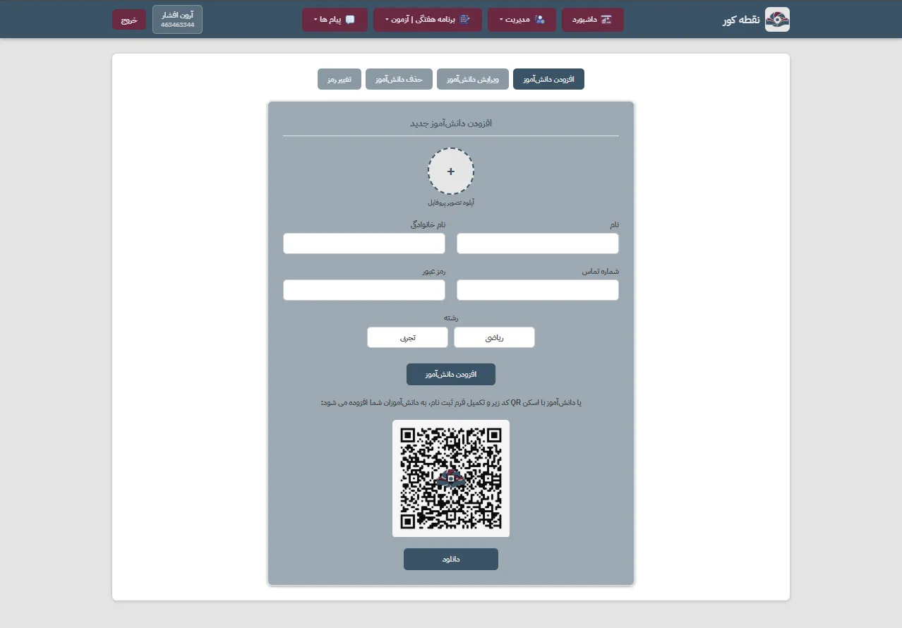

## ✨ Key Features

### 🏛️ Institute
- Full automation of consultant and student management
- 24/7 performance monitoring of consultants
- Financial management and detailed reporting
- Message and report review system
- Consultant team management

### 👨‍🏫 Consultant
- Online assignment registration and tracking
- Assignment status monitoring (solved / unsolved / correct / incorrect)
- Fully free exam hosting
- **AI-powered question generation** with exam-grade quality
- Question-by-question exam analysis
- Detailed report card for each student
- Direct messaging with institute and students

### 🧑‍🎓 Student
- Smart assignment delivery
- **Integrity Check:** after submitting an assignment, a follow-up question on the same topic is sent to the student
- Answer submission and instant feedback
- Point collection through assignment completion
- **Convert points into real money**
- Academic report card based on exam performance
- Competitive ranking against other students

## 🤖 Artificial Intelligence

- **Smart Question Generation:** AI-driven questions with exam-level quality
- **Exam Analysis:** Precise evaluation of student performance on every question
- **Adaptive Assignments:** Questions tailored to each student's level
- **Integrity System:** Ensures genuine understanding and real learning

## 🛠️ Tech Stack

| Layer | Technology |
|-------|------------|
| **Backend** | Django |
| **Frontend** | HTML, CSS, JavaScript |
| **AI / ML** | TensorFlow, Scikit-learn, Transformers |
| **Database** | MySQL |

## 🎯 Competitive Advantages

- **Full automation** of educational workflows
- **High-quality AI-generated** questions
- **Precise performance analysis** for every student
- **Motivational system** that converts points into real money
- **Transparent communication** between institute, consultant, and student
- **Learning verification** through targeted integrity questions

> **NoghteKur** — Where education gets smarter 🚀
